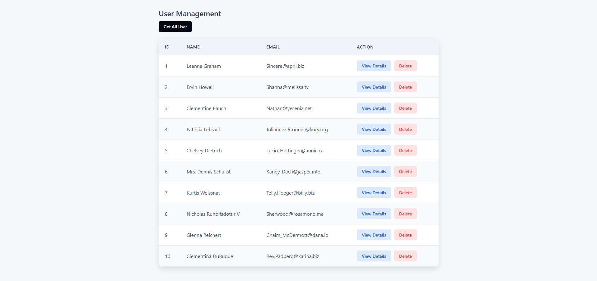

# User Management System

A responsive user management dashboard built with HTML, CSS, and JavaScript that allows users to fetch and display data using AJAX API calls.



## Features

- **User Listing**: View all users in a clean, responsive table format
- **Detailed User Profiles**: Access comprehensive information for individual users
- **User Deletion**: Remove users from the system with a simple click
- **AJAX Integration**: Fetch user data dynamically from REST API endpoints
- **Responsive Design**: Optimized for both desktop and mobile devices

## Technologies Used

- HTML5
- CSS3
- JavaScript (ES6+)
- AJAX for API communication
- Responsive design principles

## 🚀 Demo

[View Live Demo](https://alimohaamed.github.io/User-Management-System/) (placeholder link)


## Usage

- Click the "Get All User" button to fetch and display all users
- Use the "View Details" button to see comprehensive information about a specific user
- Click the "Delete" button to remove a user from the system

## API Integration

This project demonstrates integration with RESTful APIs using AJAX. The following endpoints are utilized:

- `GET /https://jsonplaceholder.typicode.com//users` - Retrieve all users
- `GET /https://jsonplaceholder.typicode.com//users/{id}` - Retrieve a specific user's details
- `DELETE /https://jsonplaceholder.typicode.com//users/{id}` - Remove a user from the system


## Project Structure

```
User-Management-System/
├── index.html         # Main HTML file
├── css/
│   └── style.css      # Stylesheet file
├── js/
│   └── script.js      # JavaScript functionality
└── README.md          # Project documentation
```


## 📱 Responsive Breakpoints


## 🌟 Support

Star the project if you find it useful! Contributions and feedback are always welcome.

---

**Crafted with ❤️ by Ali Mohamed**